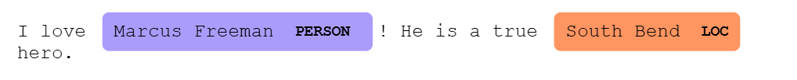
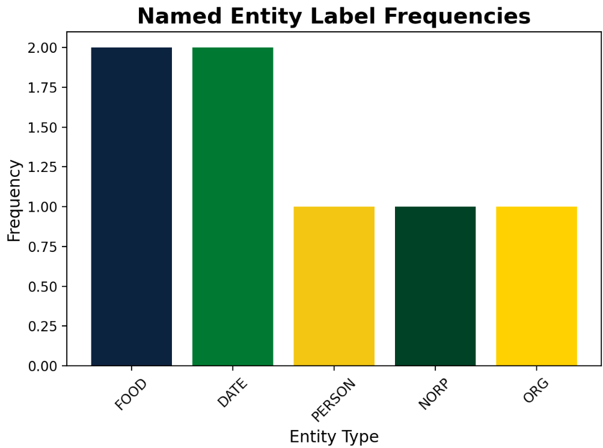

# 🧠 Named Entity Recognition (NER) App  
**Built with Python, spaCy, and Streamlit**

---

## 📌 Project Overview

This interactive web app allows users to explore Named Entity Recognition (NER) using [spaCy](https://spacy.io/)'s powerful NLP capabilities — specifically, the `EntityRuler`. Users can upload or input their own text, define custom entity labels and patterns (like tagging `"pickles"` as a `FOOD`), and instantly visualize the recognized entities highlighted in the text.

spaCy’s NER pipeline uses statistical models and rule-based matchers to identify entities such as `PERSON`, `ORG`, `GPE`, `DATE`, and more. This app adds the ability to insert **custom rules** using spaCy’s `EntityRuler`, enabling greater flexibility and experimentation with domain-specific data.

---

## ⚙️ Setup Instructions

### ✅ Run Locally

1. **Clone the repo**  
   ```bash
   git clone https://github.com/yourusername/NERStreamlitApp.git
   cd NERStreamlitApp
   ```

2. **Create a virtual environment (optional but recommended)**  
   ```bash
   python -m venv venv
   source venv/bin/activate  # or venv\Scripts\activate on Windows
   ```

3. **Install required packages**  
   ```bash
   pip install -r requirements.txt
   ```

4. **Download the spaCy model**  
   ```bash
   python -m spacy download en_core_web_sm
   ```

5. **Run the app**  
   ```bash
   streamlit run app.py
   ```

---

### 🌐 Deployed Version

> 👉 [Click here to view the deployed app on Streamlit Community Cloud](https://your-streamlit-deployed-link.streamlit.app)

---

## ✨ App Features

- 📄 **Upload or type custom text**
- 🧠 **Explore spaCy’s default NER model**
- 🏷️ **Add custom entities** by labeling phrases or words (e.g., `"Spinelli's ranch"` as `FOOD`)
- 🎨 **Visual highlighting** of all entities in context
- 📊 **Bar and pie charts** to analyze entity frequency
- ♻️ **Reset** your custom rules anytime to start fresh

#### 🧪 Example Pattern
- Label: `FOOD`  
- Pattern: `fried pickles`  
→ Highlights every match of "fried pickles" as a `FOOD` entity in the text.

---

## 🔗 References

- [spaCy Documentation](https://spacy.io/usage)
- [EntityRuler Component](https://spacy.io/api/entityruler)
- [Streamlit Documentation](https://docs.streamlit.io/)
- [spaCy Visualizer – displacy](https://spacy.io/usage/visualizers)

---

## 🖼️ Visual Examples

> *(Add these screenshots directly to your repo and embed them like below)*

```markdown


```

