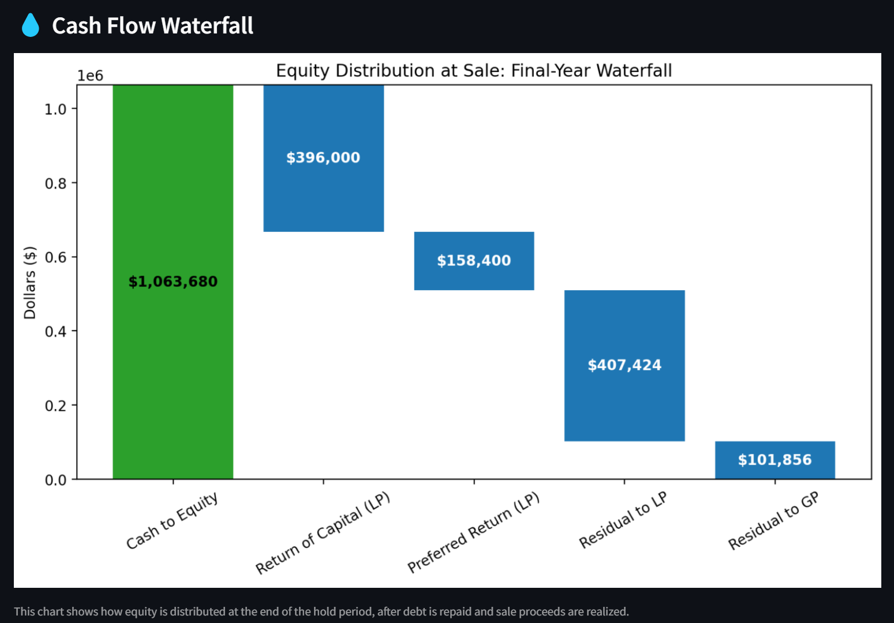

# 🏢 Multifamily Value-Add Deal Visualizer & Waterfall Modeler
Welcome! This is an interactive web app built with Streamlit that helps users explore how real estate private equity firms analyze and structure multifamily value-add investments. The app is designed to make complex real estate deal modeling approachable—whether you're a student, an aspiring investor, or just curious about how these deals work.

## 📊 Project Overview
In a multifamily value-add deal, investors acquire underperforming apartment properties and increase their value through renovations, improved operations, and rent growth. These projects generate returns by increasing the property’s income and selling it at a higher valuation.

This app brings that concept to life by allowing users to:

- 🧮 Model renovation costs, rent growth, stabilized income, and exit values
- 💧 Simulate IRR-based equity waterfalls with LP/GP return splits
- 📈 Visualize projected financials across a multi-year holding period
- 📘 Learn key real estate finance terms with plain-English explanations

The app applies concepts I learned in real estate and finance courses at Notre Dame—and reflects my personal interest in the field of real estate private equity.

## 🧠 Skills & Technologies Used
- Python
- Streamlit
- NumPy & Pandas
- Matplotlib
- Real Estate Private Equity Concepts
- Multi-page app architecture (Streamlit native)

## 📸 App Preview
Deal Visualizer:


Waterfall Modeling:




## 🌐 Live Demo
Check out the app here: Multifamily Value-Add Deal Visualizer on Streamlit Cloud

## 🚀 Run the App Locally
First, ensure you have Python 3.8+ installed along with the required libraries. You can install dependencies using:

```bash
Copy code
pip install -r requirements.txt
```

Then, clone the repository and run the app from your terminal:

```bash
Copy code
git clone https://github.com/yourusername/StreamlitAppFinal.git
cd StreamlitAppFinal
streamlit run Home.py
```
The app will launch in your default browser. Use the sidebar to navigate across pages.

## 📘 Pages Included
- 📊 Deal Visualizer: Set assumptions for units, rent, renovations, cap rate, and value
- 📉 Waterfall Modeling: Define LP/GP equity, preferred return, and promote
-🧾 Pro Forma: View year-by-year income, expenses, debt service, and cash flow
- 📘 Glossary: Get clear, simple definitions of real estate finance terms

## 🙋‍♂️ About Me, the Creator!
As a Finance major with a passion for real estate private equity, I built this app to combine my interest in investment modeling with the coding skills I’ve developed. The app integrates what I’ve learned in Notre Dame’s real estate curriculum and applies it in an interactive format.

## 🙏 Special Thanks
- Professor David Smiley - Elements of Computing, University of Notre Dame
- Professor Mike O'Malley – Co-Founder of Pennybacker Capital & Adjunct Professor
- Professor David Hutchinson – Real Estate Finance, University of Notre Dame
