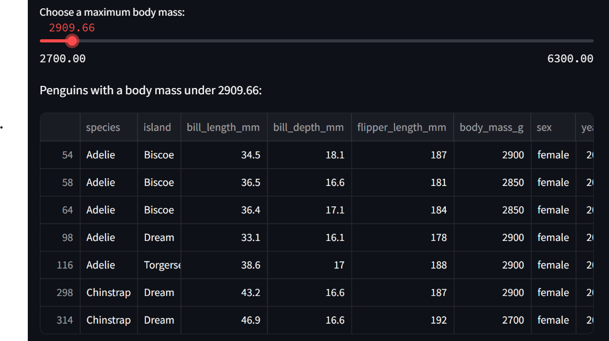

# The Penguin App 🐧
Welcome! This is a simple interactive web app built with Streamlit that visualizes data from the Palmer Penguins dataset. This app allows users to filter penguin data by island, species, and body mass, and view the results dynamically.

## 📊 Project Overview
The Penguin App was developed as an introduction to building interactive data apps using Streamlit. It demonstrates how to:
- Load and display structured data using pandas
- Add interactive filters and sliders
- Dynamically update charts or tables based on user input

The dataset contains measurements for 344 penguins across several species and islands in Antarctica, collected by researchers at the Palmer Station.

## App Preview
Below is a preview of the Penguin App interface:



## 🌐 Live Demo
Check out the app here: [The Penguin App on Streamlit Cloud](https://thepenguinapp.streamlit.app/)


## 🚀 Or Run the App Locally:
First, ensure you have Python 3.8+ installed along with the required libraries. You can install dependencies using:
   ```bash
    pip install streamlit pandas
   ```
Then, close the repository and run the app from your terminal: 
 ```bash
    streamlit run basic_streamlit_app/main.py
   ```
The app will launch in your default browser.

## 🧠 Skills & Technologies Used:
- Python
- Streamlit
- Pandas
- Palmer Penguins Dataset (palmerpenguins)

## 🐧 Dataset Source
This app uses the Palmer Penguins dataset, an alternative to the Iris dataset for data visualization and exploration.

